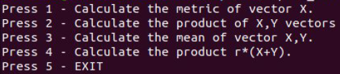
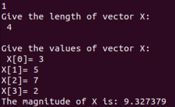

# RPC-Socket-Server
A socket server in C-RPC which accepts multi-client requests for vector operations.

**Generate files**
```
rpcgen -a -C cal.x
```

**Makefile.cal**
```
CC=gcc
CFLAGS += -g -DRPC_SVC_FG
RPCGENFLAGS = -C
```


## Compile

```
make -f Makefile.cal
```

## Testing

First run the server
```
./cal_server
```

Open another terminal and run the client
```
./cal_client localhost
```

### Menu


### Example

